# Phase 1 — AWS Account Security Setup

Most DevSecOps tutorials start with launching a server. The right place to
start is securing the account that server will run in — every account-level
control needed before a single EC2 instance or pipeline exists.

📝 [Full write-up on Medium →](https://rpriest0.medium.com/%EF%B8%8F-end-to-end-devsecops-kubernetes-project-phase-1-of-4-7b870ce22666)

> ⚠️ **Never use the root account for day-to-day tasks.** Root has
> unrestricted access to everything and cannot be restricted by IAM
> policies. All work past Module 1.3 is performed as the `devsecops-admin`
> IAM user created there.

## Modules

| # | Module | Key output |
|---|---|---|
| 1.1 | Billing Alerts & Cost Protection | 3 CloudWatch billing alarms ($10/$25/$50) + AWS Budget |
| 1.2 | Root Account Security | MFA on root, zero root access keys |
| 1.3 | IAM Admin User Setup | `devsecops-admin` — `AdministratorAccess`, MFA, own CLI keys |
| 1.4 | IAM Password Policies & Credential Reports | 14-char policy, 90-day expiry, audited credential report |
| 1.5 | AWS CLI & OIDC Setup | CLI configured, `GitHubActionsRole` via OIDC — no static AWS keys in CI |
| 1.6 | Network Baseline — VPC & Security Groups | Default SG stripped, VPC Flow Logs → encrypted S3 bucket |
| 1.7 | AWS SSM — No SSH | Port 22 never opened; Session Manager logs to S3 + KMS-encrypted CloudWatch |

## What's in this folder

```
docs/phase-1-aws-account-security/
├── README.md
├── policies/
│   ├── github-actions-trust-policy.json   ← OIDC trust policy, GitHubActionsRole
│   ├── ec2-trust-policy.json              ← trust policy, EC2-SSM-Role
│   ├── logs-key-policy.json               ← KMS key policy, encrypts /aws/ssm/sessions log group
│   └── ssm-kms-decrypt-policy.json        ← extra decrypt grant (see note below)
└── screenshots/                            ← 18 screenshots, one per step below
```

> All AWS account IDs are redacted to `<AWS_ACCOUNT_ID>` — swap in your own
> when reusing.

> **Note on `ssm-kms-decrypt-policy.json`:** this file isn't mentioned in
> the published write-up, which states the SSM agent never calls KMS
> directly and needs no extra permissions. It's included here as a real
> artifact from the actual deployment — worth double-checking during
> Phase 2 whether it was needed in practice (e.g. for a role reading the
> encrypted log group directly) or was a leftover from troubleshooting.

---

## Module 1.1 — Billing Alerts & Cost Protection

This project spins up 3+ EC2 instances simultaneously in Phase 2. A
misconfigured instance left running overnight can quietly cost $10–20.
Billing alerts need to exist *before* any resources do.

1. Enable IAM access to billing (account menu → Account → *IAM user and
   role access to billing information* → Activate)
2. **Billing Preferences** → enable Free Tier alerts + Billing alerts
   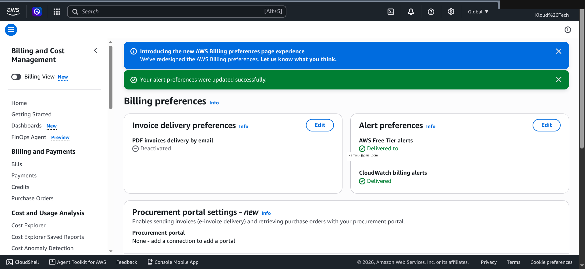
3. Three CloudWatch billing alarms in **us-east-1** (billing alarms only
   work in that region regardless of where other resources live):
   `Billing-Alert-$10`, `Billing-Alert-$25`, `Billing-Alert-$50`, sharing
   one SNS topic
   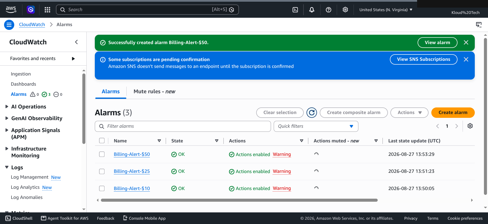
   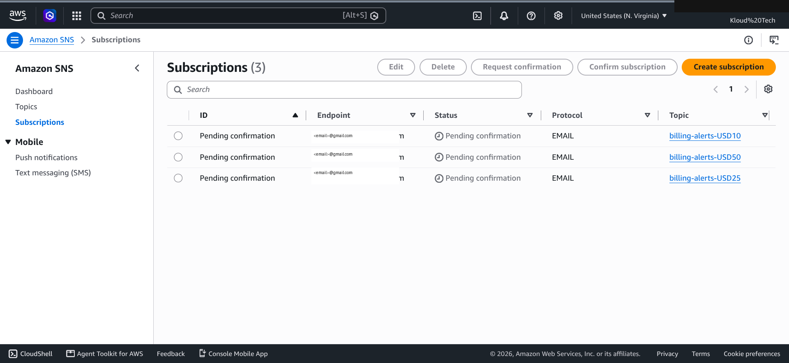
   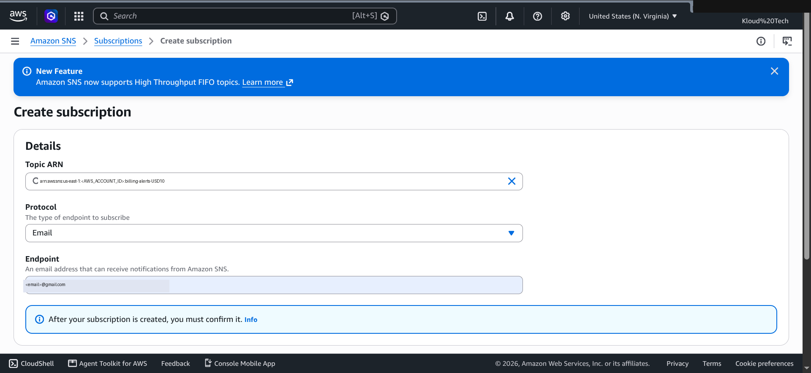
   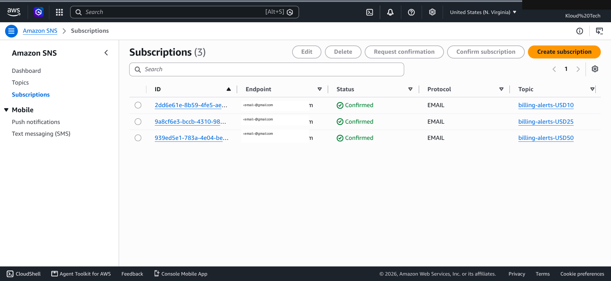
4. A second layer: AWS Budget, $50/month
   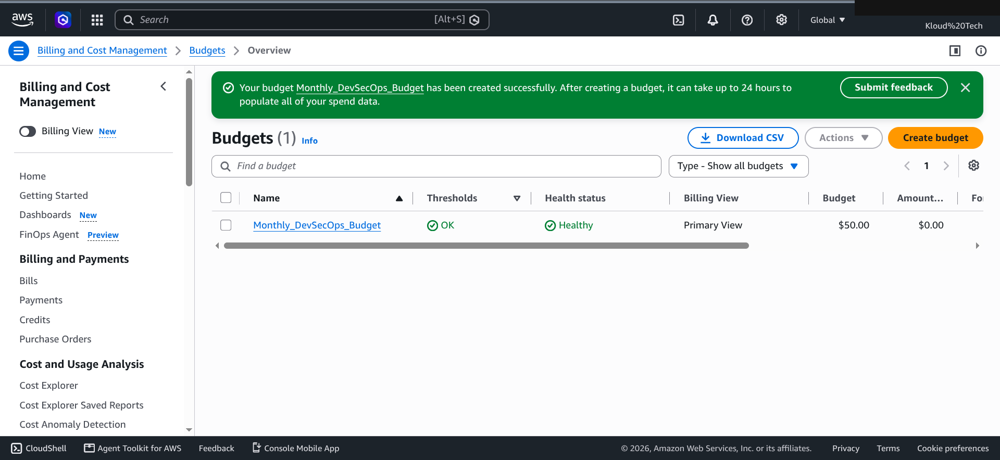

## Module 1.2 — Root Account Security

Root has complete, unrestricted access and cannot be constrained by any
policy. If root credentials leak, the account is gone.

1. MFA on root (`root-mfa-device`, authenticator app)
2. Delete any root access keys — root should never have programmatic keys
3. Strong 20+ character root password, stored in a password manager, used
   only for closing the account or restoring a locked-out admin
   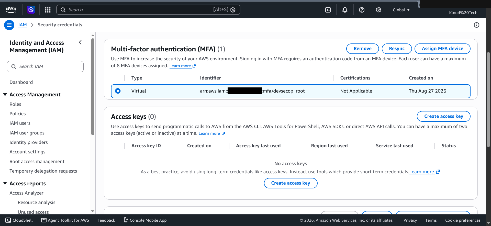
   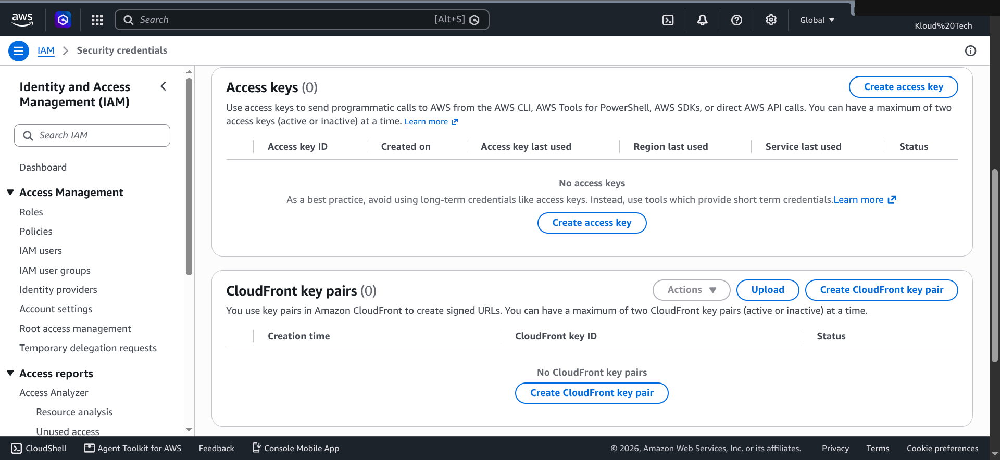

## Module 1.3 — IAM Admin User Setup

`devsecops-admin` gets `AdministratorAccess` directly — everything root can
do except touch billing payment settings or close the account.

1. Create user, console access, `AdministratorAccess` attached
   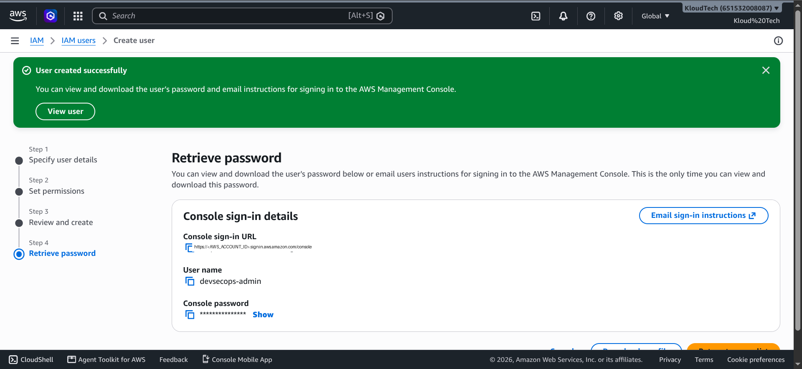
2. MFA on the admin user (separate authenticator entry from root)
   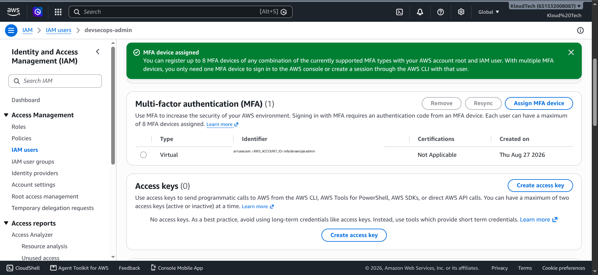
3. CLI access keys created for `devsecops-admin` (secret stored immediately
   — it's shown only once)
4. Switch: sign out of root, sign in as `devsecops-admin`
   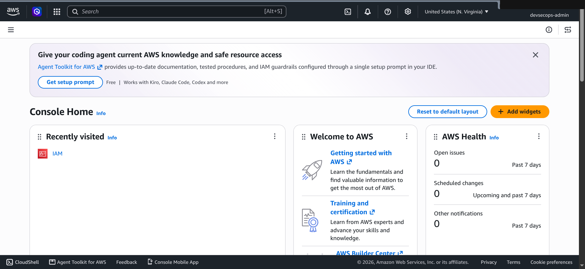

## Module 1.4 — IAM Password Policies & Credential Reports

Demonstrates security maturity expected by SOC 2 / ISO 27001 / PCI-DSS,
even with a single user today.

- Password policy: 14-char minimum, upper/lower/number/symbol required,
  90-day expiry, no reuse of last 5
  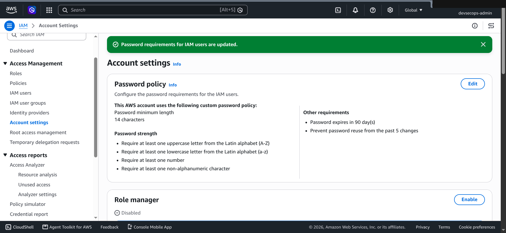
- Credential report generated as audit evidence (every IAM entity's MFA
  status, password age, key rotation in one CSV)
  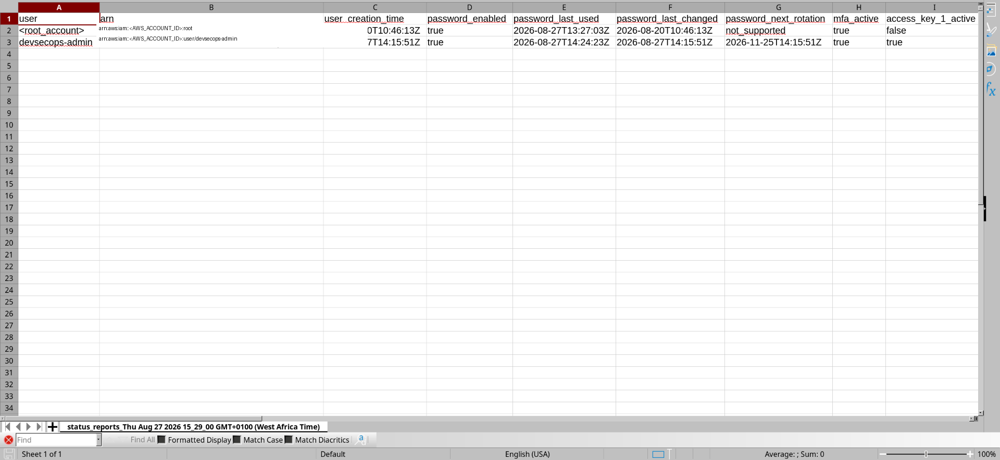

## Module 1.5 — AWS CLI & OIDC Setup

OIDC replaces long-lived CI/CD credentials with tokens that expire
automatically after every pipeline run — nothing long-lived sits in GitHub.

```bash
aws configure   # verify with:
aws sts get-caller-identity
```
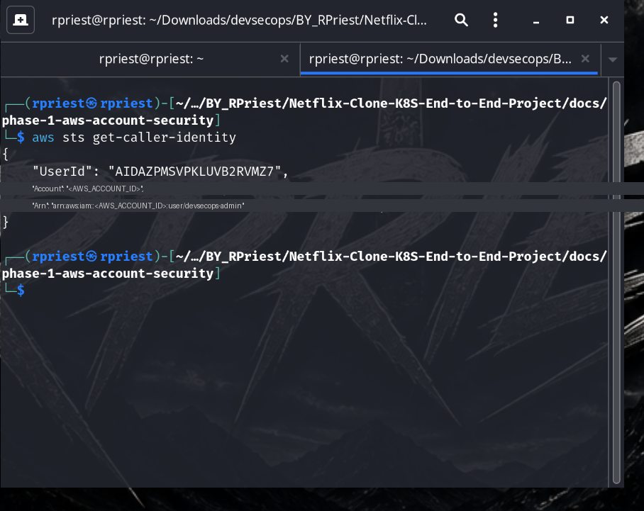

```bash
# GitHub OIDC identity provider
aws iam create-open-id-connect-provider \
  --url https://token.actions.githubusercontent.com \
  --client-id-list sts.amazonaws.com \
  --thumbprint-list 6938fd4d98bab03faadb97b34396831e3780aea1

# GitHubActionsRole, trusting only your GitHub repos (see policies/github-actions-trust-policy.json)
aws iam create-role \
  --role-name GitHubActionsRole \
  --assume-role-policy-document file://policies/github-actions-trust-policy.json \
  --description 'Role assumed by GitHub Actions via OIDC'

aws iam attach-role-policy \
  --role-name GitHubActionsRole \
  --policy-arn arn:aws:iam::aws:policy/AmazonEC2FullAccess
aws iam attach-role-policy \
  --role-name GitHubActionsRole \
  --policy-arn arn:aws:iam::aws:policy/AmazonEC2ContainerRegistryFullAccess
```
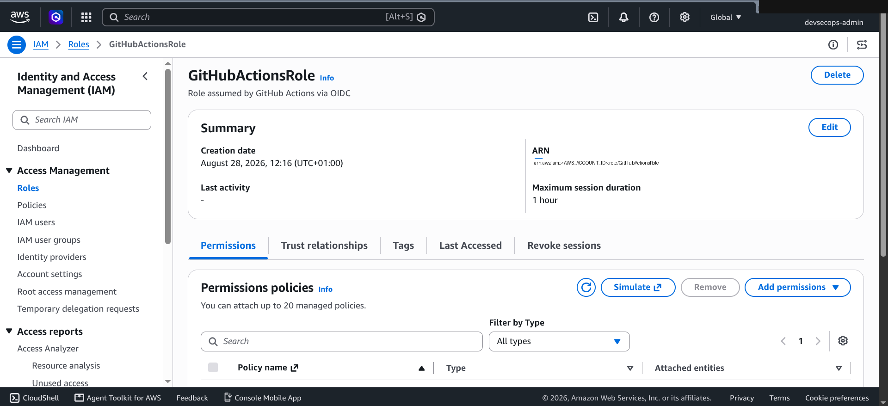

## Module 1.6 — Network Baseline: VPC & Security Groups

Phase 2 uses the default VPC with hardened security groups; Phase 3
replaces it entirely with a Terraform-managed, segmented VPC.

1. Review the default VPC
   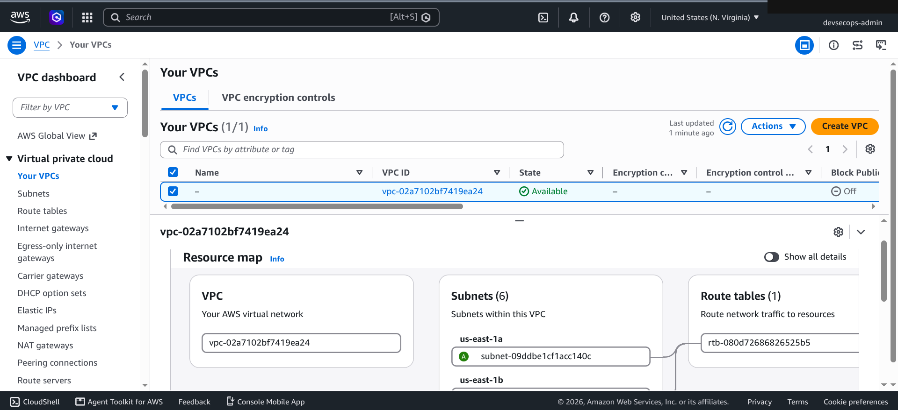
2. Strip the default security group's inbound rules entirely (outbound
   stays "allow all" so instances can still reach package repos)
3. VPC Flow Logs → **S3** (not CloudWatch), to an encrypted, public-blocked
   bucket:

```bash
aws s3 mb s3://devsecops-vpc-flow-logs-<AWS_ACCOUNT_ID> --region us-east-1

aws s3api put-bucket-encryption \
  --bucket devsecops-vpc-flow-logs-<AWS_ACCOUNT_ID> \
  --server-side-encryption-configuration '{
    "Rules": [{"ApplyServerSideEncryptionByDefault": {"SSEAlgorithm": "AES256"}}]
  }'

aws s3api put-public-access-block \
  --bucket devsecops-vpc-flow-logs-<AWS_ACCOUNT_ID> \
  --public-access-block-configuration \
  BlockPublicAcls=true,IgnorePublicAcls=true,BlockPublicPolicy=true,RestrictPublicBuckets=true
```
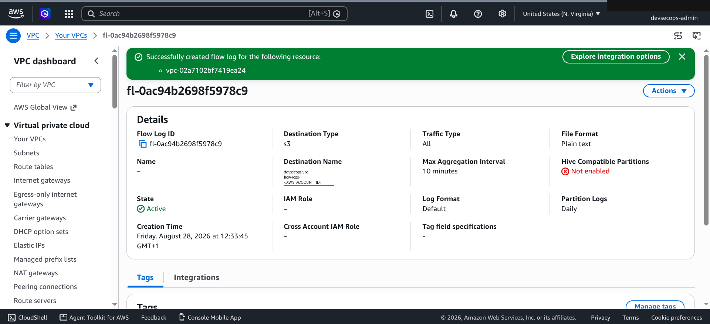

## Module 1.7 — AWS SSM: Secure Server Access Without SSH

SSH needs an open port 22, a `.pem` key file, and produces no audit log.
Session Manager removes all three — IAM handles auth, no inbound port
needed, every command logged to CloudTrail (and optionally S3/CloudWatch).

```bash
# EC2-SSM-Role (see policies/ec2-trust-policy.json)
aws iam create-role \
  --role-name EC2-SSM-Role \
  --assume-role-policy-document file://policies/ec2-trust-policy.json \
  --description 'Allows EC2 instances to use SSM Session Manager'
aws iam attach-role-policy \
  --role-name EC2-SSM-Role \
  --policy-arn arn:aws:iam::aws:policy/AmazonSSMManagedInstanceCore
aws iam create-instance-profile --instance-profile-name EC2-SSM-Profile
aws iam add-role-to-instance-profile \
  --instance-profile-name EC2-SSM-Profile \
  --role-name EC2-SSM-Role
```

CloudWatch Logs in this account requires an encrypted log group, so a KMS
key goes behind it before Session Manager will save logs there
(`policies/logs-key-policy.json`):

```bash
aws kms create-key --description "KMS key for SSM session CloudWatch logs" --region us-east-1
# attach policies/logs-key-policy.json to the new key, then:
aws logs create-log-group \
  --log-group-name /aws/ssm/sessions \
  --kms-key-id arn:aws:kms:us-east-1:<AWS_ACCOUNT_ID>:key/<KEY_ID> \
  --region us-east-1
aws logs put-retention-policy \
  --log-group-name /aws/ssm/sessions --retention-in-days 90 --region us-east-1
```

Then in console: **Systems Manager → Session Manager → Preferences** —
enable both S3 logging and CloudWatch logging.
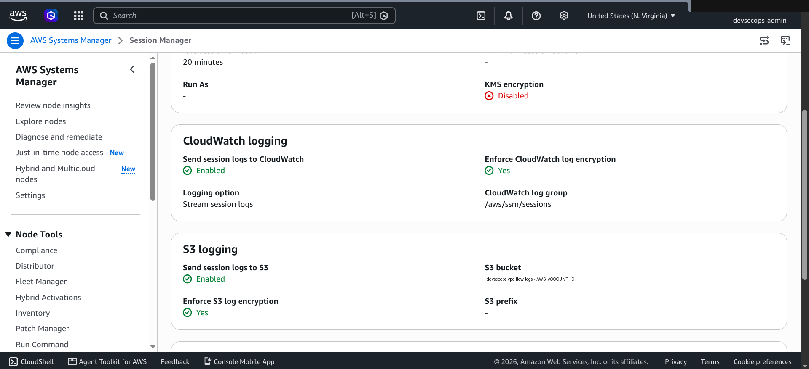

Connecting later (Phase 2 preview, no `.pem` key, no port 22):
```bash
aws ssm start-session --target i-0123456789abcdef0
```

---

## Before starting Phase 2, confirm

1. Logged in as `devsecops-admin`, not root
2. `aws sts get-caller-identity` returns the IAM user
3. `GitHubActionsRole` ARN is saved for later phases

---
[← Back to project overview](../../README.md)
