# Phase 2 — Full Advanced DevSecOps Pipeline on AWS EKS (Netflix Clone)

A 25-module build of a complete, security-gated CI/CD pipeline: an EKS
cluster, three purpose-built EC2 servers, and a 20+ stage Jenkins pipeline
that takes a Netflix-clone frontend from `git push` to a running,
monitored, GitOps-deployed application — with a secret scanner, three
SAST tools, two SCA tools, a container scanner, a DAST scanner, an SBOM
generator, and a centralized vulnerability dashboard checking every step.

📝 [Full write-up on Medium →](https://rpriest0.medium.com/end-to-end-devsecops-kubernetes-project-phase-2-of-4-07d6b4da0ed6)

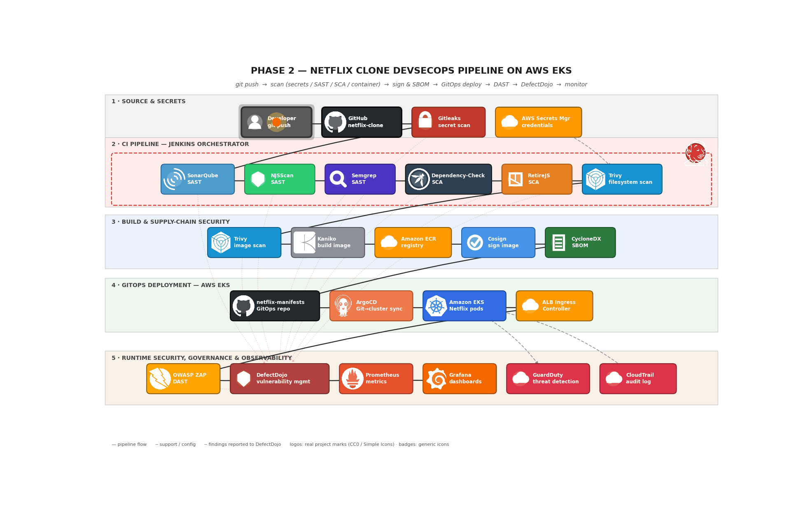

> ⚠️ **Never use the root account for day-to-day tasks.** All work here is
> performed as the `devsecops-admin` IAM user created in
> [Phase 1](../phase-1-aws-account-security).

## Pipeline at a glance

```
git push → Gitleaks (secrets) → SonarQube + NJSScan + Semgrep (SAST)
        → Trivy fs scan → OWASP Dependency-Check + RetireJS (SCA)
        → Kaniko build/push to ECR (rootless) → Cosign sign image
        → Update netflix-manifests repo → ArgoCD sync to EKS
        → Wait for ALB target health → ZAP (DAST, live URL)
        → CycloneDX SBOM + osv-scanner
        → Upload every report to DefectDojo → Slack notification
```

## Modules

| # | Module | # | Module |
|---|---|---|---|
| 2.1 | Architecture & pipeline overview | 2.14 | ArgoCD GitOps deployment |
| 2.2 | AWS EKS cluster setup | 2.15 | ALB Ingress Controller |
| 2.3 | AWS ECR — private registry | 2.16 | ZAP DAST scanning |
| 2.4 | EC2 infra (least privilege, 3 servers) | 2.17 | CycloneDX SBOM generation |
| 2.5 | Jenkins install & config | 2.18 | AWS Secrets Manager (no plaintext creds) |
| 2.6 | SonarQube SAST | 2.19 | GuardDuty & CloudTrail |
| 2.7 | Gitleaks — secret scanning | 2.20 | DefectDojo — centralized vuln management |
| 2.8 | NJSScan + Semgrep — SAST | 2.21 | Prometheus & Grafana monitoring |
| 2.9 | Trivy — fs/image scanning | 2.22 | Slack build notifications |
| 2.10 | OWASP Dependency-Check + RetireJS | 2.23 | Full Jenkinsfile (20+ stages) |
| 2.11 | Secure Dockerfile | 2.24 | Security gap analysis |
| 2.12 | Kaniko build, push & Cosign sign | 2.25 | Teardown |
| 2.13 | Separate manifests repo (GitOps) | | |

## Where the actual files live

The files this write-up describes are **not** duplicated here — they live
at the repo root where Jenkins/kubectl/Docker actually expect to find them:

| File | Location |
|---|---|
| Pipeline definition | [`/Jenkins/Jenkinsfile`](../../Jenkins/Jenkinsfile) |
| Dockerfile | [`/Dockerfile`](../../Dockerfile) |
| EKS cluster config | [`/eks-cluster.yaml`](../../eks-cluster.yaml) |
| K8s manifests (deploy/service/ingress/netpol) | [`/k8s-manifests/`](../../k8s-manifests) |
| IAM/KMS policy documents | [`/policies/`](../../policies) |
| Monitoring stack (Prometheus/Alertmanager) | [`/monitoring/`](../../monitoring) |
| Gitleaks config | [`/security-configs/.gitleaks.toml`](../../security-configs/.gitleaks.toml) |
| Teardown & cost-audit scripts | [`/scripts/`](../../scripts) |
| DefectDojo upload script | [`/upload-to-defectdojo.py`](../../upload-to-defectdojo.py) |
| Cosign public key | [`/cosign.pub`](../../cosign.pub) |
| App source | [`/Application-Code/`](../../Application-Code) |

Sample scan reports (real output from a build run) live in
[`sample-scan-reports/`](./sample-scan-reports) in this folder, alongside
the screenshots — this is evidence, not something Jenkins reads.

> All AWS account IDs and KMS key IDs are redacted to `<AWS_ACCOUNT_ID>` /
> `<APP_KMS_KEY_ID>` / `<SSM_SESSION_KMS_KEY_ID>` — swap in your own when
> reusing. **`cosign.key` (the private signing key) is deliberately not
> included anywhere in this repo** — it must stay a Jenkins credential
> only, never committed.

## Module 2.2 — EKS Cluster Setup

```bash
eksctl create cluster -f eks-cluster.yaml
kubectl get nodes
aws eks update-kubeconfig --name netflix-devsecops --region us-east-1
```

A brand-new/Free-Tier AWS account typically caps On-Demand vCPUs at 5.
Two `t3.small` worker nodes plus three EC2 servers (Module 2.4) can hit
that ceiling, so the cluster launches with a single on-demand node — the
Service Quotas page below is what justifies adding the second worker as a
**Spot** instance instead, which draws from a separate quota entirely.

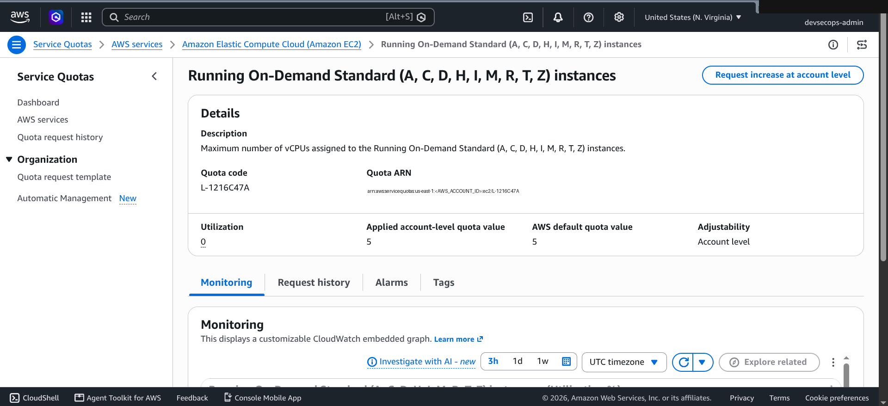
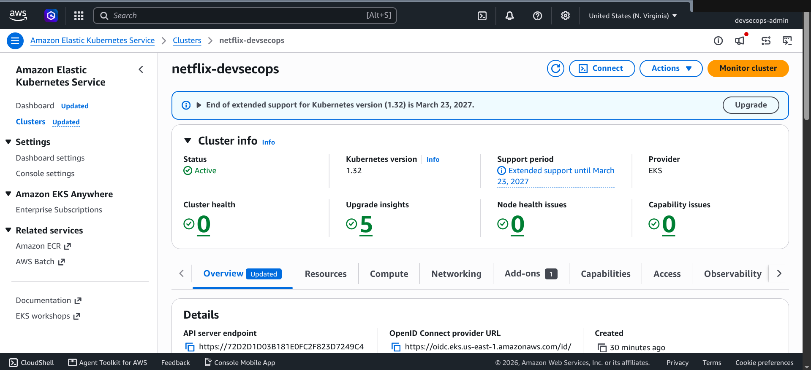
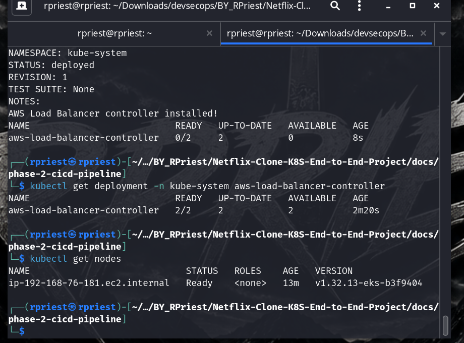

```bash
eksctl create nodegroup \
  --cluster netflix-devsecops --region us-east-1 \
  --name netflix-workers-spot --instance-types t3.small \
  --nodes 1 --nodes-min 1 --nodes-max 2 --spot --node-private-networking

kubectl get nodes -L eks.amazonaws.com/capacityType
```
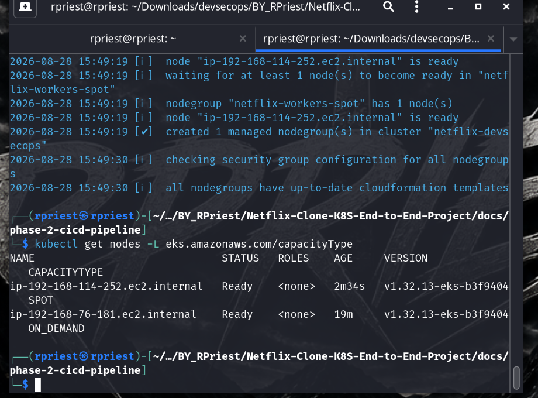

> Node counts here reflect the initial build. The nodegroups were scaled
> up later in the project after running into scheduling issues once more
> workloads (monitoring DaemonSet, 2 app replicas, ALB controller) needed
> to land — see the teardown screenshot at the bottom of this page for
> the final instance count before cleanup.

🔒 **Security fix:** EKS CloudWatch logging enabled for all API calls,
audit, and auth events. API server restricted to the admin's IP
(`publicAccessCIDRs`), Kubernetes Secrets encrypted with a customer-managed
KMS key, IMDSv2 enforced on worker nodes, and scoped access entries used
instead of the default cluster-admin mapping.

## Module 2.3 — ECR (Private Container Registry)

```bash
aws ecr create-repository --repository-name netflix-clone \
  --image-scanning-configuration scanOnPush=true \
  --encryption-configuration encryptionType=AES256 --region us-east-1

aws ecr put-lifecycle-policy --repository-name netflix-clone \
  --lifecycle-policy-text file://policies/ecr-lifecycle.json
```

🔒 ECR Basic scanning (Clair-powered) runs automatically on every push.
This account uses Basic rather than Enhanced/Inspector scanning due to a
free-tier restriction — it still catches CVEs at push time, just doesn't
continuously re-scan afterward. The lifecycle policy caps storage at the
10 most recent images.

## Module 2.4 — EC2 Infrastructure (Least Privilege, 3 Servers)

With EKS managing Kubernetes, only 3 servers are needed: **Jenkins**
(`m7i-flex.large`, keeps `EC2-SSM-Role` from Phase 1 — the only server
with EKS + Secrets Manager access), **Monitoring** (`t3.small`), and
**DefectDojo** (`c7i-flex.large`) — the latter two get scoped-down roles
with just SSM/CloudWatch/S3 baseline permissions, so compromising either
never hands over Jenkins-level cluster access.

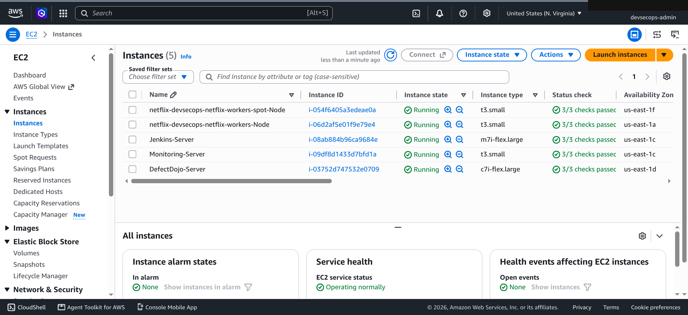

🔒 All EBS volumes encrypted. Port 22 never opened — SSM Session Manager
only. IMDSv2 enforced (`HttpTokens=required`) on every instance.

## Module 2.5 — Jenkins Installation & Configuration

Installed via SSM session (no SSH), with the AWS CLI, Java 21, Docker,
and every scanning tool (Trivy, Gitleaks, Semgrep, NJSScan, RetireJS,
osv-scanner) installed directly on the host.

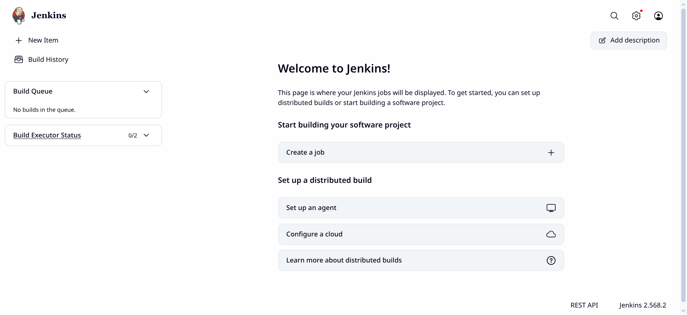
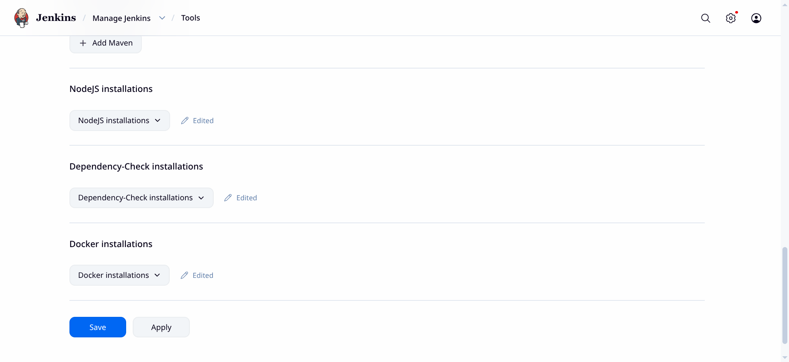

A nightly cron job (`docker image prune -af --filter "until=72h"`) keeps
the 35GB Jenkins volume from filling up with old build layers.

## Module 2.6 — SonarQube SAST

```bash
docker run -d --name sonarqube --restart unless-stopped -p 9000:9000 sonarqube:lts-community
```

The **DevSecOps-Gate** quality gate is what makes SonarQube actually block
deployments — Security Rating worse than A, any Vulnerabilities, or
Security Hotspots Reviewed under 100% all fail the gate.

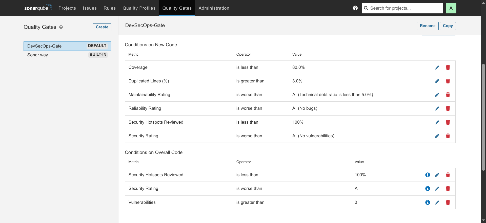
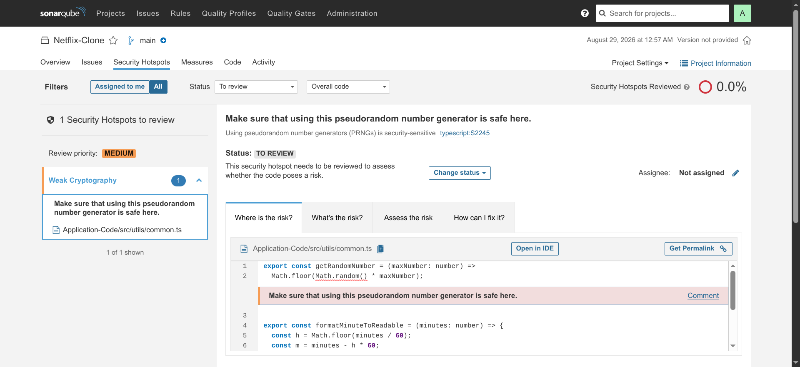

The Netflix Clone's movie-selection code uses `Math.random()` for UI
randomization, which SonarQube correctly flags as a Security Hotspot —
resolved as "Safe" with a comment, since it's not used for anything
security-sensitive.

🔒 Pipeline stage aborts on High/Critical findings — deployment blocked,
not just logged.

## Module 2.7 — Gitleaks: Secret Scanning

Two layers: a local pre-commit hook (before code ever reaches GitHub) and
a Jenkins pipeline stage as the second line of defense.

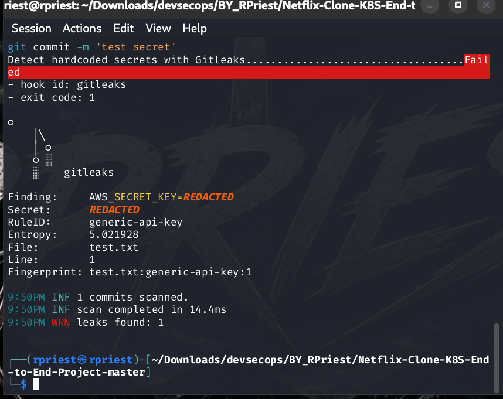

```bash
echo 'AWS_SECRET_KEY=xK9pQmZ4vT2wRcYbNjLdEaFgHiJkLmNoPqRsTuVw' > test.txt
git add test.txt && git commit -m 'test secret'
# Gitleaks BLOCKS the commit and shows the detected secret
```

## Module 2.8–2.10 — Multi-Tool SAST & SCA

NJSScan + Semgrep run independently for SAST (no single tool catches
everything); OWASP Dependency-Check + RetireJS run independently for SCA.
A bypass or blind spot in one tool never blinds the whole pipeline.

## Module 2.11 — Secure Multi-Stage Dockerfile

The final image contains only compiled static assets served by nginx —
no Node runtime, no build tools, no source code, no TMDB API key baked in
(it's only ever a build-time `ARG`, never an `ENV` in the final stage).

## Module 2.12 — Kaniko Build & Cosign Signing

Kaniko builds and pushes to ECR as an ephemeral, rootless container — no
Docker socket exposure. Every image is then signed with Cosign:

```bash
cosign generate-key-pair   # produces cosign.key (private) + cosign.pub (public)
```

The private key is stored as a **Jenkins credential** (a file — AWS
Secrets Manager only holds strings), never committed to this repo.

## Module 2.13 — Separate Manifests Repository (GitOps)

Application code and Kubernetes manifests live in two different repos.
Jenkins only ever writes to `netflix-manifests`; it never touches the
cluster directly.

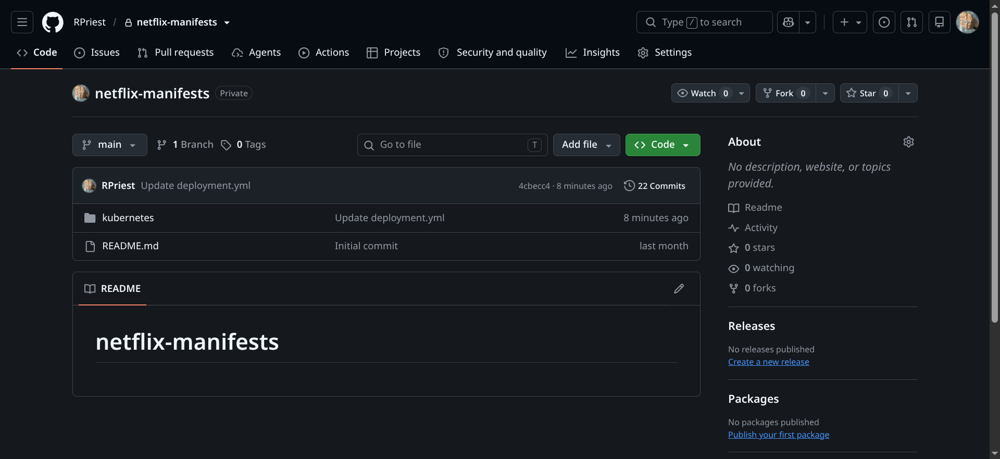

## Module 2.14 — ArgoCD GitOps Deployment

ArgoCD runs **inside** the cluster and pulls changes from Git — pull-based,
not push-based. If Jenkins is ever compromised, the attacker still can't
reach Kubernetes directly.

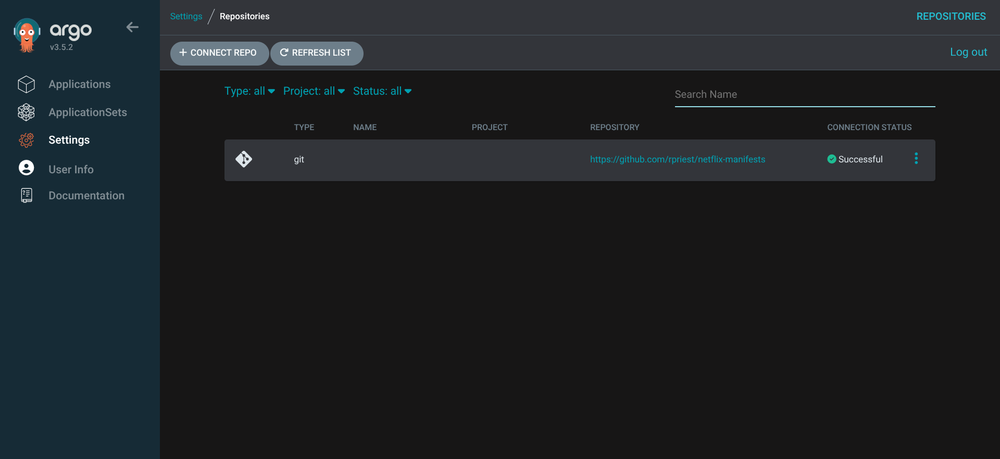
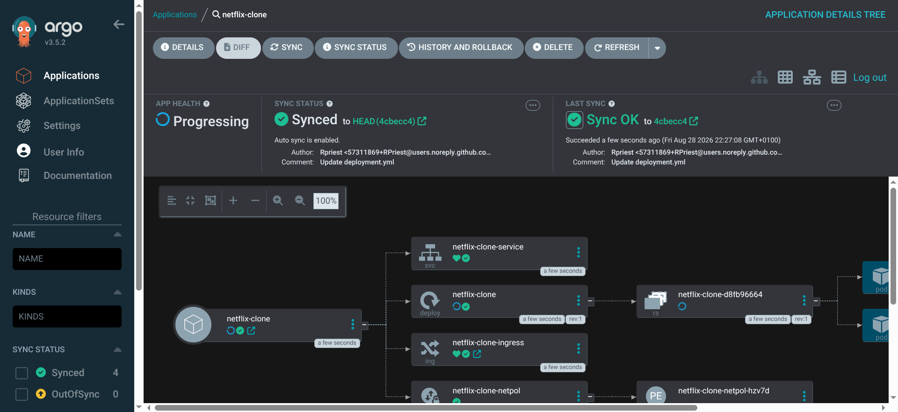
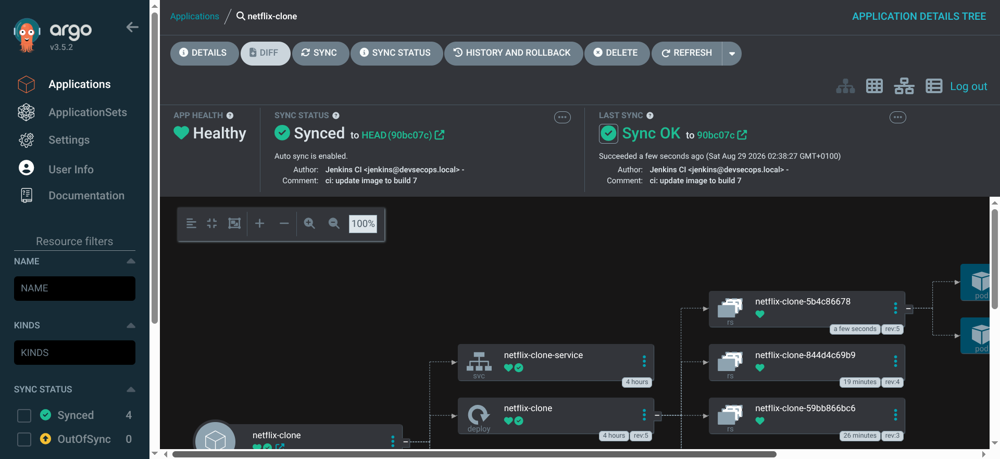

A dedicated, scoped-down `jenkins` ArgoCD account (sync + read-status
only on `default/netflix-clone`) replaces using the admin token directly.

🔒 Self Heal enabled — manual drift in the cluster is automatically
reverted to match Git.

## Module 2.15 — ALB Ingress Controller

The AWS Load Balancer Controller (installed via Helm in Module 2.2)
provisions the ALB automatically once `ingress.yml` syncs.

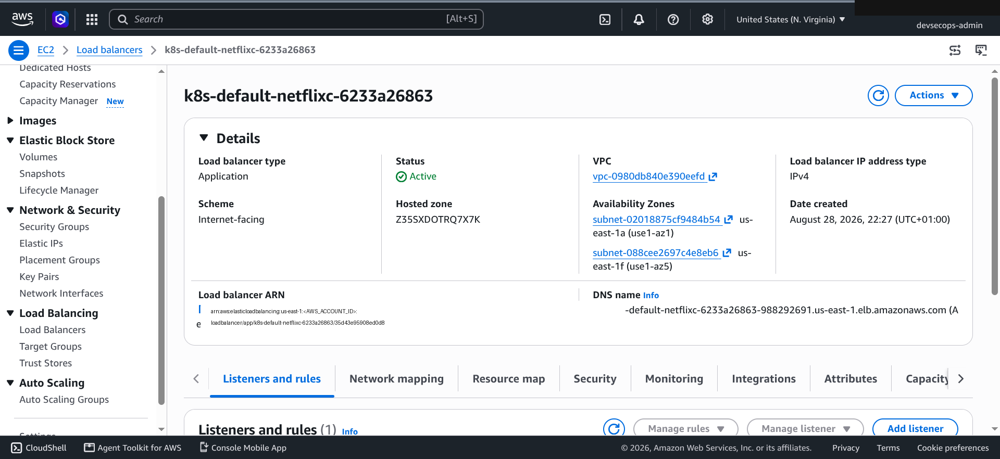

A **Wait for Target Health** pipeline stage polls the target group until
every pod passes health checks (or times out after 3 minutes) before the
DAST scan runs — no fixed sleep guessing at readiness.

## Module 2.16 — ZAP DAST Scanning

Static analysis (2.6–2.10) can't see how the app behaves once deployed.
ZAP attacks the live ALB URL the same way an external attacker would.

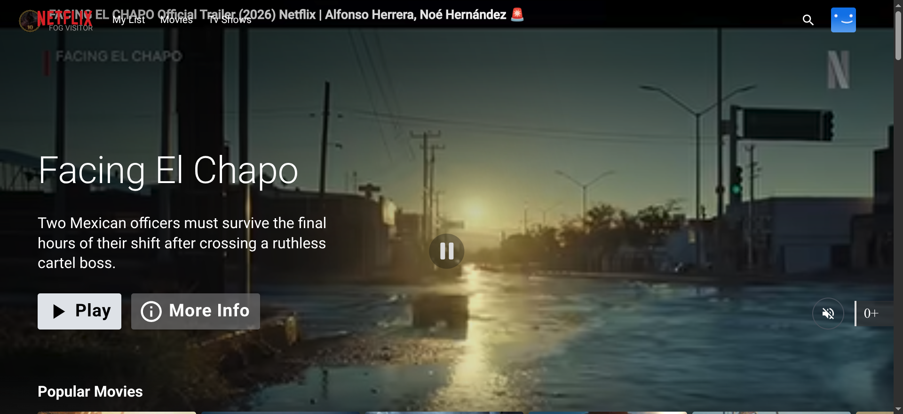

## Module 2.17 — CycloneDX SBOM Generation

`cdxgen` runs fresh on every build (not just at release), feeding
`osv-scanner` so new CVEs against old dependencies get caught
automatically — not just what was known when a package was first added.

## Module 2.18 — AWS Secrets Manager

Every runtime secret (TMDB, SonarQube, GitHub PAT, DefectDojo, Cosign
password, Slack webhook, ArgoCD token) lives in one encrypted Secrets
Manager document, retrieved at runtime via the Jenkins EC2 role — never
stored as Jenkins Secret Text credentials.

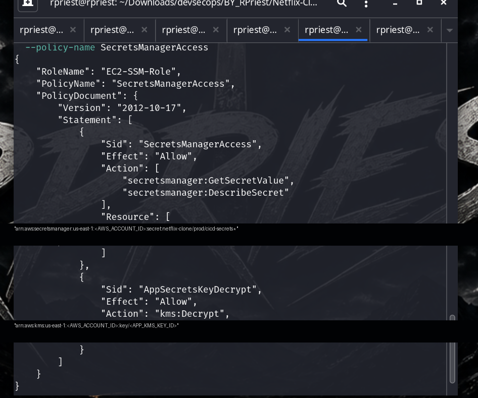

## Module 2.19 — GuardDuty & CloudTrail

Detective controls catch what prevention misses. CloudTrail logs every
control-plane API call to an encrypted, public-blocked S3 bucket.

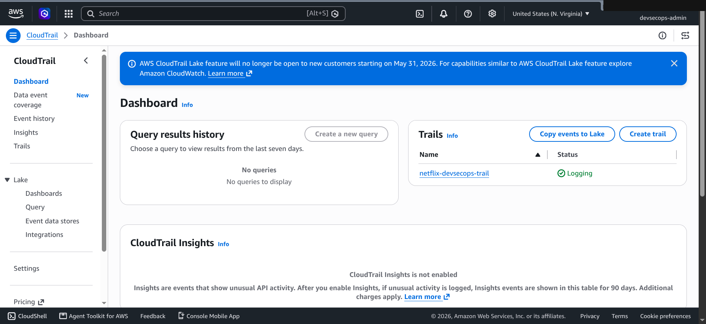

## Module 2.20 — DefectDojo: Centralized Vulnerability Management

8+ scanners produce 8+ report formats. DefectDojo aggregates, dedupes,
and tracks remediation across all of them in one dashboard.

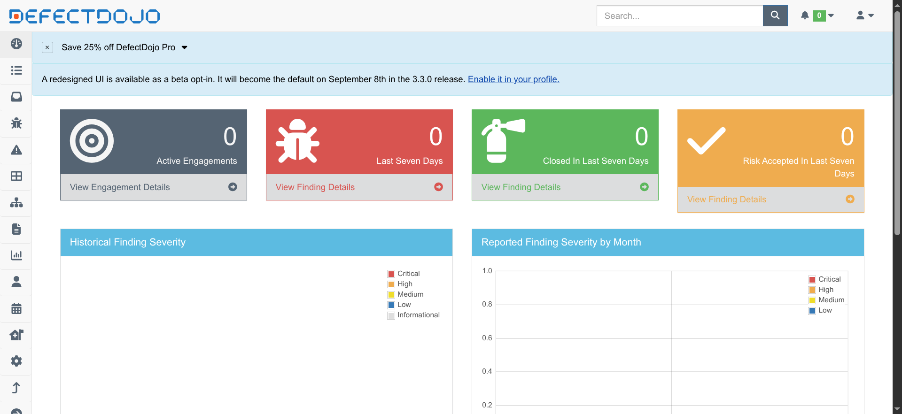
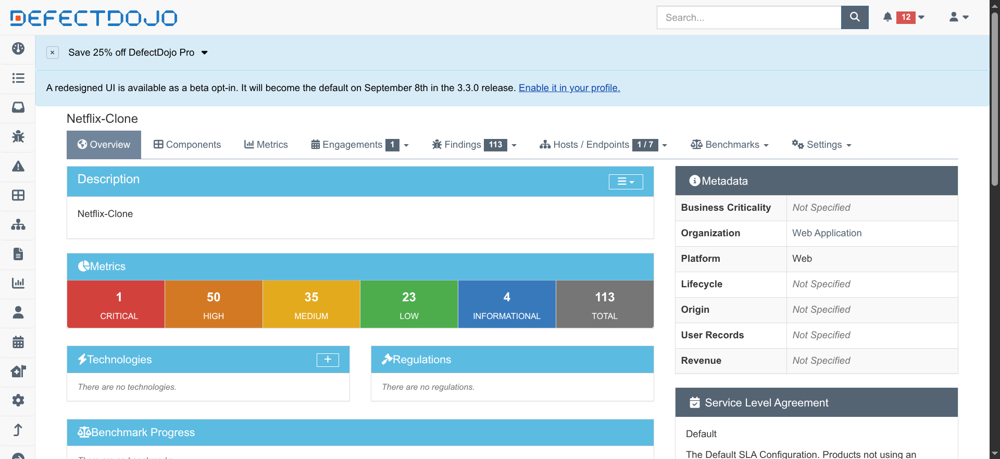

## Module 2.21 — Prometheus & Grafana Monitoring

A dedicated monitoring server (separate from EKS, so observability
survives a cluster outage) scrapes host metrics from Jenkins/DefectDojo
via `node_exporter`, plus Kubernetes-native metrics via a Helm-deployed
node-exporter DaemonSet and `kube-state-metrics`. Getting traffic to flow
required a VPC peering connection between the default VPC (where the
three EC2 servers live) and the separate VPC eksctl created for EKS.

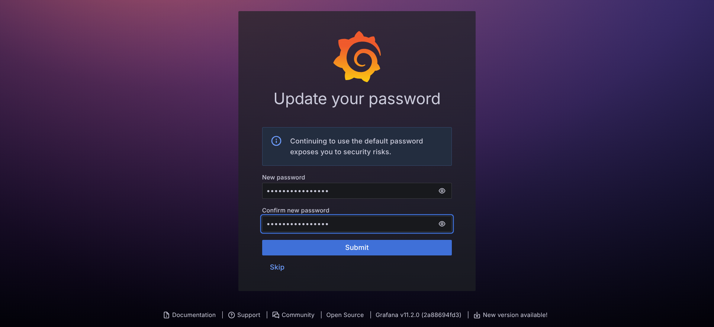
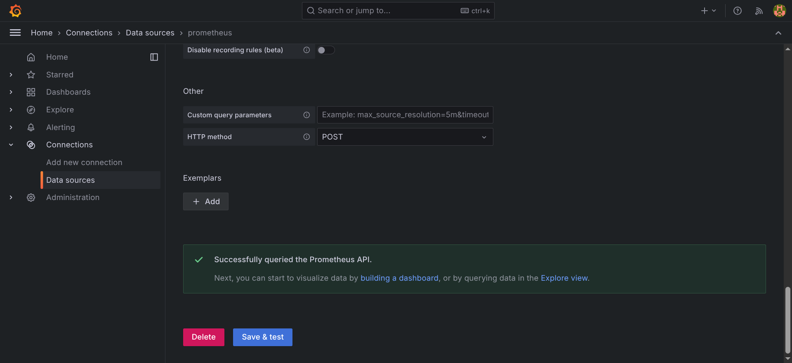
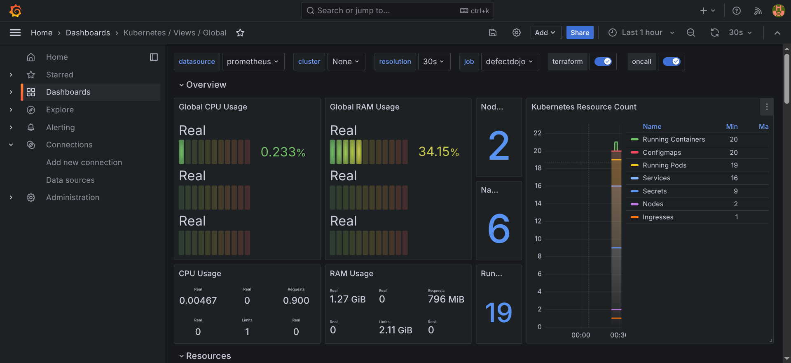
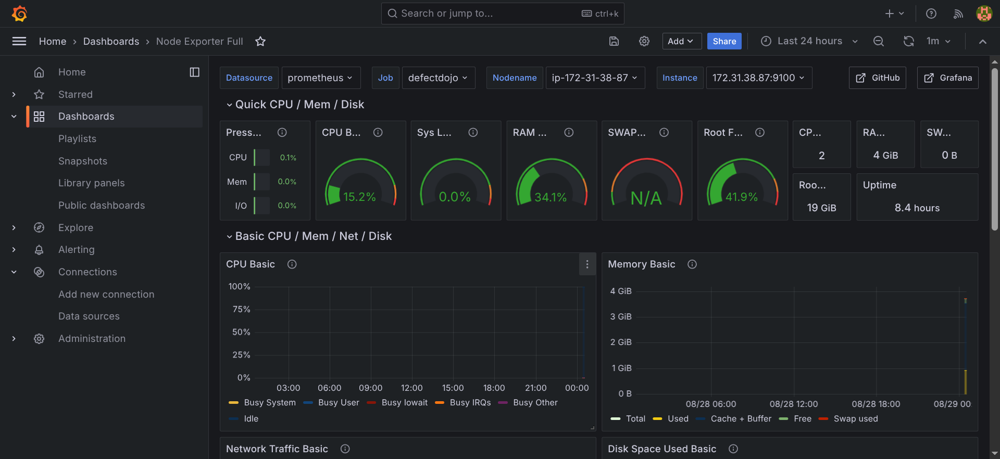
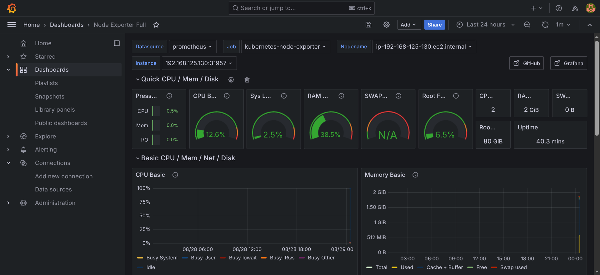
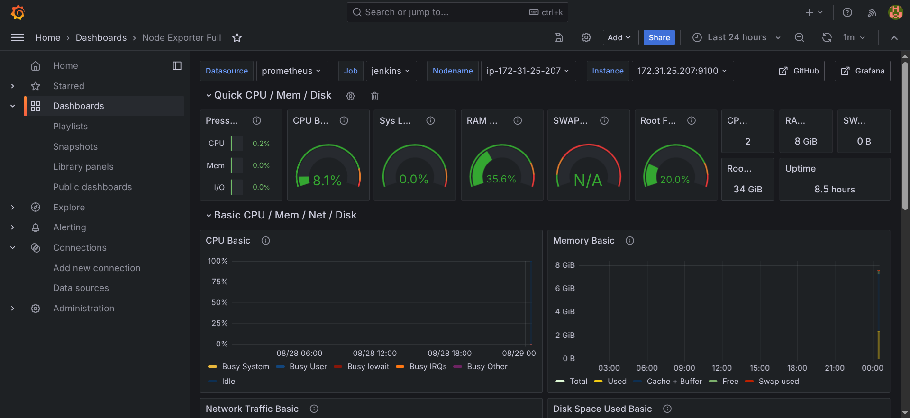

## Module 2.22 — Slack Build Notifications

A `sendSlack()` Groovy function (defined at the top of the Jenkinsfile)
posts to `#devsecops-builds` on every pipeline success/failure — no
Jenkins Slack plugin, no webhook stored as a Jenkins credential; it's
pulled from Secrets Manager at runtime, same as everything else.

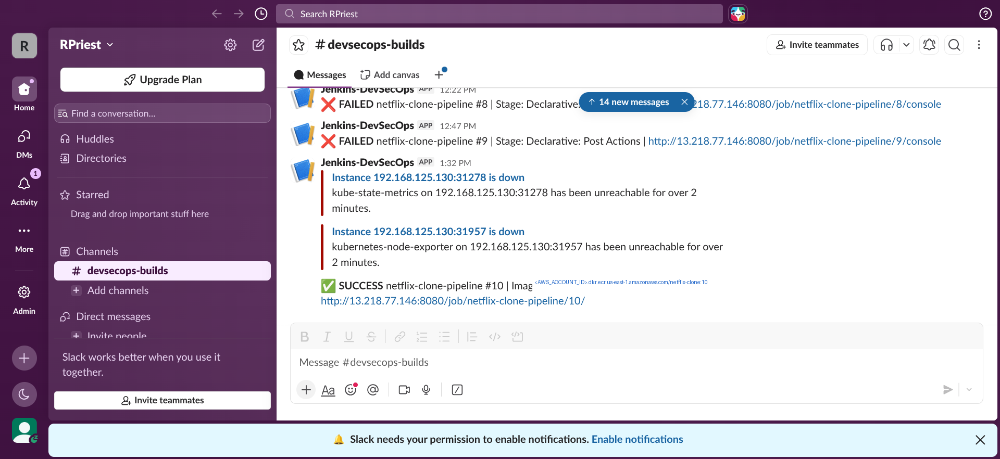

## Module 2.23 — The Full Jenkinsfile

20+ stages, tied together end to end. See
[`/Jenkins/Jenkinsfile`](../../Jenkins/Jenkinsfile) for the complete file.

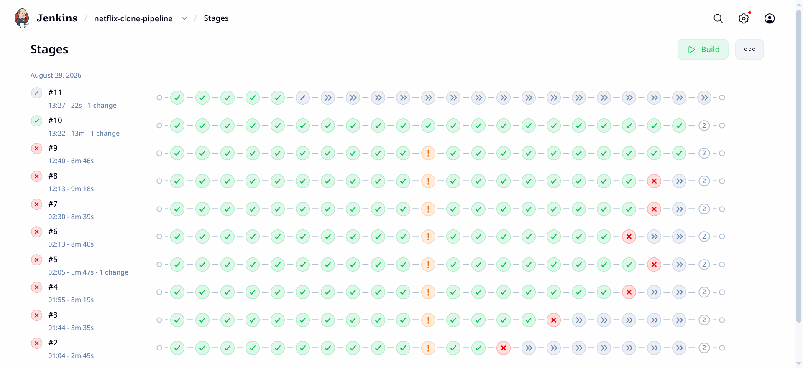
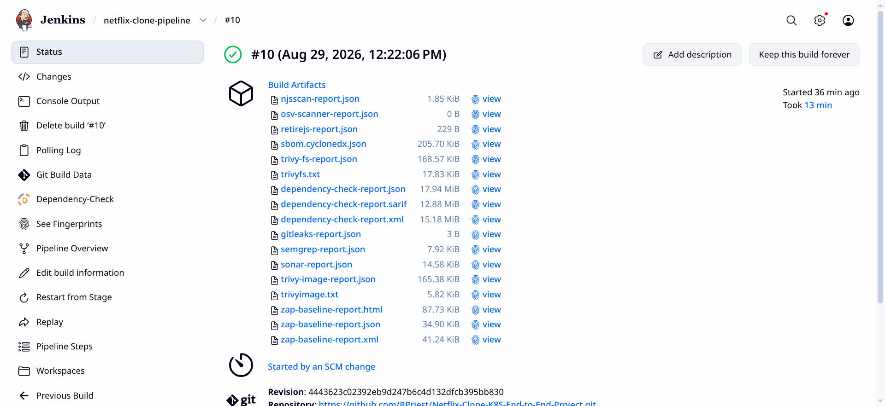

## Module 2.24 — Security Gap Analysis (Results)

- 113 total findings aggregated in DefectDojo across every scanner
- 199 SAST findings triaged across SonarQube + NJSScan + Semgrep
- 16 ZAP DAST alerts caught against the live deployment
- 100 known CVEs surfaced across 34 dependencies via SBOM + osv-scanner
- OpenSSF Scorecard improved 2.6 → 2.8
- A critical RCE-vulnerable dependency blocked from merging via PR gate

## Module 2.25 — Teardown

`scripts/teardown-phase2.sh` tears down EKS nodegroups/cluster, EC2
instances, security groups, VPC peering, and the flow-logs S3 bucket in
dependency-safe order. `scripts/aws-cost-audit.sh` is a read-only
companion script — run it anytime to check for anything still silently
billing (EBS volumes, Elastic IPs, NAT Gateways, KMS keys in
`PendingDeletion`, orphaned load balancers) without deleting anything.

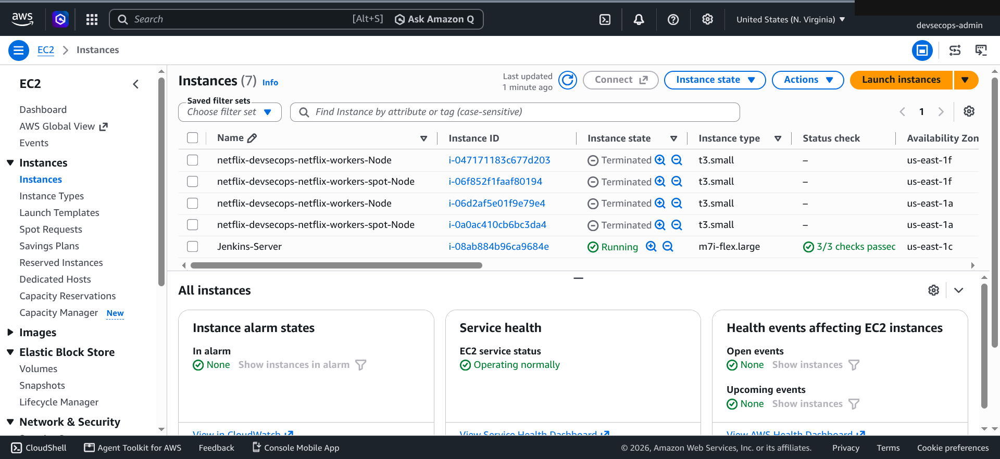

---
[← Back to project overview](../../README.md)
